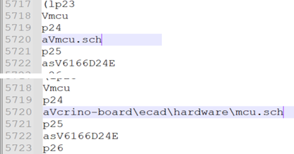

# Crino Board - Template (RevB.1.0)

Crino offers precise characterisations of lithium ion cells for quality control in battery manufacturing and research using the *crino instrument*. Every crino instrument consists of several *crino boards* with actuators and sensors that are connected to a central control system (currently a *Raspberry Pi*). This control system is performing all measurements and also provides a user interface to interact with the system. This repository consists of Kicad development files for the *board-template*. All *crino boards* should be derived from this template. 

## Project directory structure

- **docs**: Contains additional documentation of the project.
- **hardware**: Contains the KiCad project.
- **hardware/fab**: Contains automatically generated BOM, and gerber files.
- **simulation**: Contains LTSpice simulations related to this project.

## Local Development Experience

**Prerequisites**:

If you are new to `crino development workflow`, please visit [crino-onboarding](https://github.com/crinolab/crino-onboarding) and [crino-onboarding-ecad](https://github.com/crinolab/crino-onboarding-ecad/tree/master/ecad) first.

**How to use the Template**:

Open Kicad, create a `new Project by Template`. Navigate to the following path and select the *Board Template*. Create a new project with the selected template.

- `<your path>crino-repos/crino-board/ecad/hardware`

In order to update the schematics, the newly created project has to be linked to the template. Use [git submodules](https://git-scm.com/book/en/v2/Git-Tools-Submodules) to link this repository to your task specific crino-board.

- `git submodule add -f https://github.com/crinolab/crino-board.git ./ecad/hardware/crino-board`

If you want to update you task specific crino-board to a new template, use 

- `git submodule update --init --recursive`

Open Kicad again and switch to the schematics of your new project. A block called `mcu` should be visible. Enter the properties dialog and change the *sheet name* to the following path.

- `.\crino-board\ecad\hardware\mcu.sch`

Now the schematics are linked to the template project. Appending all the symbols may be necessary. 

**How to apply changes in the Layout**

in order to apply changes in the Layout. The [KiCad Action Plugins](https://github.com/MitjaNemec/Kicad_action_plugins) have to be installed. Follow the instructions on the website.  

**Workflow for the Plugin (Rev1)**

1. After updating the submodule open the template folder
2. Open the template-layout and select TP14 (Reference Point)
3. `Tools -> External Plugins -> Save/Restore Layout -> Save Layout`
4. Select `mcu.sch` in the window and save `mcu.pckl`
5. Close template layout without saving
6. Open `mcu.pckl` and change Row `5720` 

7. Open project and inspect the schematics
8. Open layout and note position of TP14
9. Delete all footprints and fracks of the template part
10. Start `Update PCB` and place the Footprints anywhere
11. Place TP14 at noted position and select it
12. `Tools -> External Plugins -> Save/Restore Layout -> Restore Layout`
13. Select `mcu.pckl` and wait until completed
14. Start DRC and correct errors
15. Save the Layout
16. Delete `mcu.pckl`

## General Components

The Template is the successor of the previously used [ESP32-POE-ISO](https://www.olimex.com/Products/IoT/ESP32/ESP32-POE-ISO/open-source-hardware). It contains all needed components of the board. 

**Basic Blocks**

The following blocks are present in the schematics:

- `poe` - Power over Ethernet controller
- `power` - Power supply for microcontroller (3.3V, 5V, 12V)
- `esp32` - [Microcontroller](https://www.espressif.com/sites/default/files/documentation/esp32-wroom-32e_esp32-wroom-32ue_datasheet_en.pdf) and programming interface  
- `ethernet` - Ethernet controller
- `io` - Pinout for derived boards

> Before you start making changes, please read the [development workflow](./docs/development-workflow.md) for Crino Power Board.
